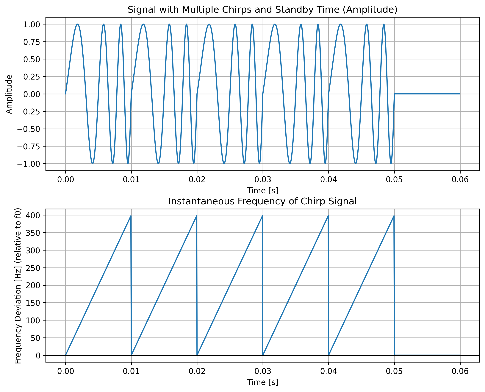
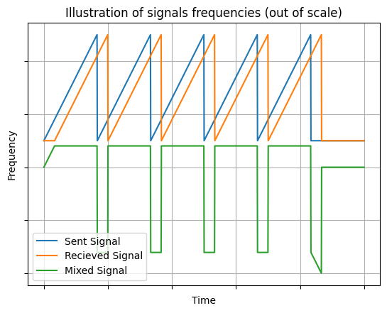
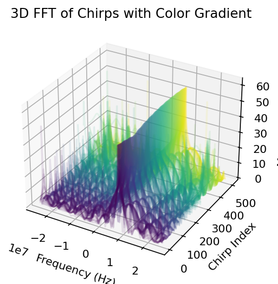
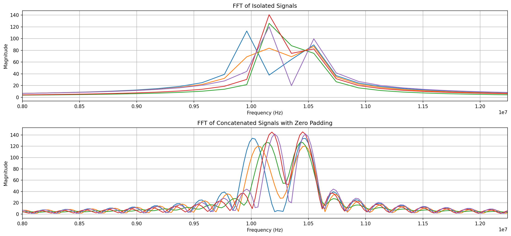

# TI FMCW Radar Simulation and Parameter Estimation Tools

This repository contains a series of Jupyter notebooks for simulating and understanding the Texas Instruments FMCW radar system, specifically focusing on AWR boards. These notebooks serve both pedagogical and practical purposes, from learning key radar concepts to calculating essential parameters for radar configuration. The notebook contains inline comments explaining parameter choices and calculations. In particular, `From-Parameters-Chirp-Simulation.ipynb` includes detailed explanations for each radar parameter to help users understand the simulation's behavior and outcomes, besides having functions to import and export configurations to .cfg config files used in the SDK GUI visualizer from Texas Instrument.

## FMCW Radar Overview

Frequency-Modulated Continuous Wave (FMCW) radar operates by transmitting a continuous waveform whose frequency is modulated over time with a constant rate. This modulation creates a pulse signal called chirp.

The radar measures the range and velocity of targets by analyzing the difference in frequency (beat frequency or intermediate frequency) between the transmitted and received signals. This frequency difference is directly related to the time delay, which corresponds to the target's distance, while the Doppler shift embedded in the signal’s phase variation provides information about the target's velocity.

Key steps in the FMCW algorithm include:
1. **Chirp Generation**: A local oscillator generates the chirped signal, which is amplified and transmitted.
2. **Signal Reception and Mixing**: The received echo, reflected off targets, is mixed with a portion of the transmitted signal. This mixing produces an intermediate frequency (IF) signal which is directly proportional to the range of the target.
3. **FFT Processing**: Fast Fourier Transform (FFT) processes are applied to the beat signal to obtain the range and Doppler profiles. Range FFT isolates targets based on distance, while Doppler FFT extracts velocity information by analyzing phase shifts across multiple chirps.
4. **Range-Doppler Map Formation**: The combined range and Doppler data create a 2D map, enabling simultaneous detection of distance and speed.

This method achieves high resolution in both range and velocity, essential for applications like automotive radars, where precise measurements are critical for object detection and tracking.

## Overview of Notebooks

1. **Doppler Simulation.ipynb**
   - This notebook provides a simulated environment to understand how Doppler frequency changes can influence the behavior of an FMCW radar system. It is designed to enhance comprehension of the underlying principles of velocity and distance detection in radar systems.
   - **Key Learning Goals:**
     - Gain insight into how radar signals are influenced by the Doppler effect.
     - Understand the relationship between signal sampling rate and resolution in velocity and distance measurements.

2. **exercises FFT.ipynb**
   - A focused exercise notebook on Fast Fourier Transform (FFT), highlighting the manipulation of resolution. Understanding this concept is crucial to adjusting the radar's parameters for desired velocity and distance resolutions with the tradeoff in processing time.
   - **Key Learning Goals:**
     - The impact of sampling rate, sample quantities and zero padding on FFT resolution.
       

3. **parameters_estimators.ipynb**
   - This practical notebook calculates the required input parameters for configuring AWR radar boards based on desired operational specifications. It considers target resolution, maximum detectable velocity, and distance, translating these needs into specific radar configuration values.
   - **Key Features:**
     - Input necessary for AWR radar configuration based on resolution and operational range requirements.
     - Provides parameter calculations tailored for TI AWR boards, aiding in accurate and efficient radar configuration.
     - Automatic import and export .cfg files.
     - Built functions to import and export .cfg config files with directly compatibility to SDK GUI visualizer from Texas Instrument.

4. **From-Parameters-Chirp-Simulation.ipynb**
   - Using configuration data from TI's default SDK, this notebook simulates the theoretical behavior of the radar system. The simulation is organized in a class-based structure, which improves readability and usability. Each parameter used in the simulation is explained within the code comments for clarity.
   - **Key Features:**
     - Class-oriented code structure for easy customization and reusability.
     - Simulates radar behavior using TI SDK configuration files, providing insights into how specific settings affect radar operation.
     - Built functions to import and export .cfg config files with directly compatibility to SDK GUI visualizer from Texas Instrument.
